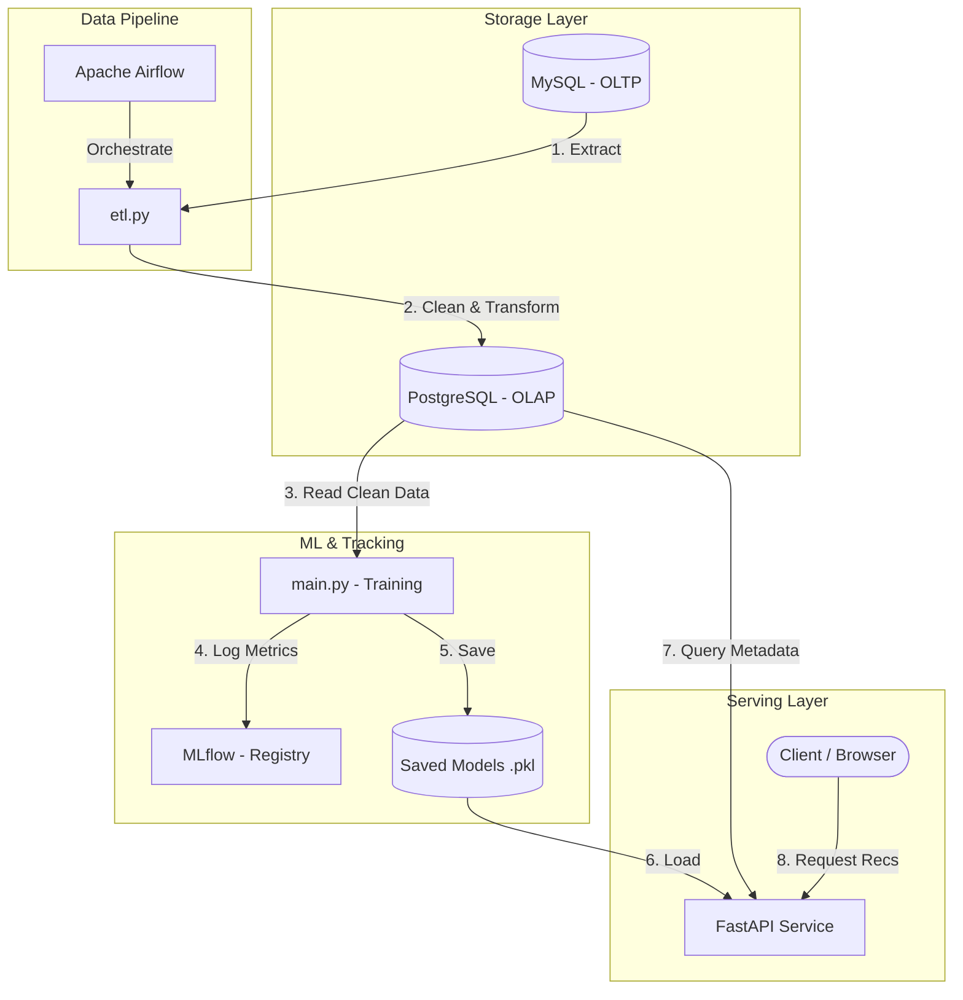

# Movie Recommendation System (MLOps Pipeline)

A complete movie recommendation system project that handles the entire pipeline: raw data storage, ETL cleaning, model training, metric tracking, and real-time API serving. The entire stack runs inside containerized environments using Docker Compose.

---

## System Architecture

Here is how data flows through the system:



1. **Raw Data (OLTP):** Stored in a MySQL instance (`movielens_oltp`).
2. **ETL Pipeline (Airflow):** Apache Airflow orchestrates the daily DAG run. The `etl.py` script extracts raw data from MySQL, cleans genre strings, parses release years, and loads the clean dataset into a PostgreSQL data warehouse (`movielens_olap`).
3. **Training & Tracking (MLflow):** The training script runs three models: Content-Based, Matrix Factorization (SVD via Surprise), and a Hybrid model. Hyperparameters and evaluation metrics (RMSE, MAE) are automatically logged to MLflow.
4. **API Serving (FastAPI):** FastAPI loads the trained model pickles to serve recommendations. The models directory is mounted, so any new model trained by Airflow automatically gets loaded by the API without restarting the containers.

---

## Dataset

We use the **MovieLens 1M dataset** containing:
* **1,000,209 ratings** from 6,040 users on 3,900 movies.
* **Users metadata** (Age, Gender, Occupation, Zip-code).
* **Movies metadata** (Title, Genres).

---

## Recommendation Algorithms

* **Content-Based Filtering (CB):**
  * Computes movie similarities by applying a **TF-IDF Vectorizer** on movie genres, followed by **Cosine Similarity**.
  * Recommends items similar to what the user has highly rated in the past.
* **Collaborative Filtering (SVD):**
  * A Matrix Factorization approach implemented using the `scikit-surprise` library.
  * Learns latent features of users and movies to predict ratings.
* **Hybrid Recommender:**
  * Combines both CB and SVD models using a weighted ensemble score.
  * Uses a custom fallback mechanism: if a user is new (cold-start), it weights heavily on Content-Based recommendations, otherwise it relies more on Collaborative Filtering predictions.

---

## Tech Stack

* **Core & API:** Python 3.10, FastAPI, Uvicorn
* **Data & Machine Learning:** Pandas, Scikit-learn, Scikit-Surprise
* **Databases:** MySQL 8.0, PostgreSQL 15, SQLAlchemy
* **Orchestration & DevOps:** Docker & Docker Compose, Apache Airflow 2.10
* **Tracking:** MLflow

---

## How to Run

### Prerequisites
* Install **Docker** and verify **Docker Desktop** is running.

### Launching the Stack

1. Run the following command in the root folder to build and start all containers:
   ```bash
   docker compose up --build
   ```

2. Access the services via the following URLs:

   * **FastAPI Server:** [http://localhost:8000/docs](http://localhost:8000/docs) (Swagger UI for testing endpoints).
   * **Airflow UI:** [http://localhost:8080](http://localhost:8080) (Credentials: `admin` / `admin`).
   * **MLflow UI:** Run this command on your host machine to view training performance:
     ```bash
     mlflow ui --backend-store-uri sqlite:///mlflow.db
     ```

---

## API Endpoints

* **`GET /health`**: Returns API status and lists which models are currently loaded in RAM.
* **`GET /recommend/user/{user_id}`**: 
  * Returns movie recommendations for a specific user.
  * *Query Parameters:* `model` (`hybrid`, `svd`, `cb` - default: `hybrid`), `top_k` (default: 10).
* **`GET /recommend/similar`**:
  * Suggests similar movies based on a given movie title.
  * *Query Parameters:* `title` (Exact movie title), `top_k` (default: 10).
